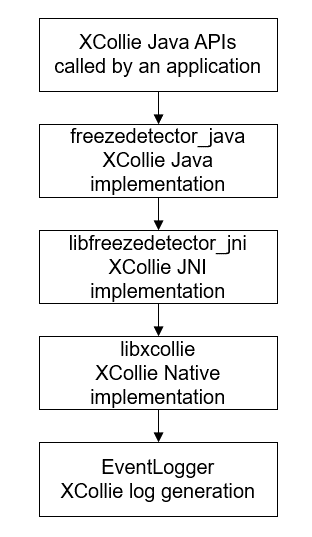

# HiCollie<a name="EN-US_TOPIC_0000001077200880"></a>

-   [Introduction](#section11660541593)
-   [Architecture](#section342962219551)
-   [Directory Structure](#section55125489224)
-   [Constraints](#section161941989596)
-   [Compilation and Building](#section20568163942320)
-   [Available APIs](#section8725142134818)
-   [Usage](#section19959125052315)
-   [Repositories Involved](#section1134984213235)

## Introduction<a name="section11660541593"></a>

HiCollie provides the software watchdog capability. It implements a unified framework for fault detection and fault log generation to help you locate software timeout faults resulting from system service deadlock, application main thread blocking, and service process timeout. 

## Architecture<a name="section342962219551"></a>



## Directory Structure<a name="section55125489224"></a>

```
/base/hiviewdfx/hicollie                       #  HiCollie home directory
├── frameworks/java                          # HiCollie Java code
├── frameworks/jni/                          # HiCollie JNI code
├── frameworks/native/                       # HiCollie Native code
├── interfaces/native/innerkits/include      # HiCollie Native header files
```

## Constraints<a name="section161941989596"></a>

A maximum of 128 timers can be registered for a single process using the HiCollie API. Excess timers are invalid and cannot be registered to implement timeout detection.

## Compilation and Building<a name="section20568163942320"></a>

For details, see the  _HiCollie Development Guide_.

## Available APIs<a name="section8725142134818"></a>

**Table  1**  Description of Java timer APIs

<a name="table20156163414814"></a>
<table><tbody><tr id="row202881215133218"><td class="cellrowborder" valign="top" width="28.470000000000002%"><p id="p12852726173214"><a name="p12852726173214"></a><a name="p12852726173214"></a>int setTimeout(String timeoutName, int timeout, Runnable callback, long flag)</p>
</td>
<td class="cellrowborder" valign="top" width="18.01%"><p id="p185211260329"><a name="p185211260329"></a><a name="p185211260329"></a>XCollie API</p>
</td>
<td class="cellrowborder" valign="top" width="53.52%"><p id="p485219261329"><a name="p485219261329"></a><a name="p485219261329"></a>Adds a timer.</p>
<p id="p13496195715568"><a name="p13496195715568"></a><a name="p13496195715568"></a>Input parameters:</p>
<p id="p78521426113213"><a name="p78521426113213"></a><a name="p78521426113213"></a><strong id="b1243226124018"><a name="b1243226124018"></a><a name="b1243226124018"></a>timeoutName</strong>: Indicates the timer name.</p>
<p id="p193451754414"><a name="p193451754414"></a><a name="p193451754414"></a><strong id="b08421624164018"><a name="b08421624164018"></a><a name="b08421624164018"></a>timeout</strong>: Indicates the timeout interval, in seconds.</p>
<p id="p1954016498433"><a name="p1954016498433"></a><a name="p1954016498433"></a><strong id="b3740172324014"><a name="b3740172324014"></a><a name="b3740172324014"></a>callback</strong>: Indicates the timeout callback.</p>
<p id="p18852172663215"><a name="p18852172663215"></a><a name="p18852172663215"></a><strong id="b13515522114010"><a name="b13515522114010"></a><a name="b13515522114010"></a>flag</strong>: Indicates the timer operation type.</p>
<p id="p685212264326"><a name="p685212264326"></a><a name="p685212264326"></a>XCOLLIE_FLAG_NOOP // Call the timeout callback only.</p>
<p id="p158521269325"><a name="p158521269325"></a><a name="p158521269325"></a>XCOLLIE_FLAG_LOG // Generate a timeout fault log.</p>
<p id="p2852182633220"><a name="p2852182633220"></a><a name="p2852182633220"></a>XCOLLIE_FLAG_RECOVERY // Exit the process.</p>
<p id="p17852152616325"><a name="p17852152616325"></a><a name="p17852152616325"></a>Output parameters: none</p>
<p id="p13852182643217"><a name="p13852182643217"></a><a name="p13852182643217"></a>Return value: Returns the timer ID if the operation is successful; returns <strong id="b098311257320"><a name="b098311257320"></a><a name="b098311257320"></a>-1</strong> otherwise.</p>
</td>
</tr>
<tr id="row921116343814"><td class="cellrowborder" valign="top" width="28.470000000000002%"><p id="p1421115341988"><a name="p1421115341988"></a><a name="p1421115341988"></a>boolean updateTimeout(int id, long timeout)</p>
</td>
<td class="cellrowborder" valign="top" width="18.01%"><p id="p1821117342082"><a name="p1821117342082"></a><a name="p1821117342082"></a>XCollie API</p>
</td>
<td class="cellrowborder" valign="top" width="53.52%"><p id="p8211534588"><a name="p8211534588"></a><a name="p8211534588"></a>Updates a timer.</p>
<p id="p7767123045710"><a name="p7767123045710"></a><a name="p7767123045710"></a>Input parameters:</p>
<p id="p1521114342084"><a name="p1521114342084"></a><a name="p1521114342084"></a><strong id="b269819444011"><a name="b269819444011"></a><a name="b269819444011"></a>id</strong>: Indicates the timer ID.</p>
<p id="p7560037101613"><a name="p7560037101613"></a><a name="p7560037101613"></a><strong id="b011711315404"><a name="b011711315404"></a><a name="b011711315404"></a>timeout</strong>: Indicates the timeout interval, in seconds.</p>
<p id="p172111734384"><a name="p172111734384"></a><a name="p172111734384"></a>Output parameters: none</p>
<p id="p1621113347813"><a name="p1621113347813"></a><a name="p1621113347813"></a>Return value: Returns <strong id="b4935135112510"><a name="b4935135112510"></a><a name="b4935135112510"></a>true</strong> if the operation is successful; returns <strong id="b8554114119516"><a name="b8554114119516"></a><a name="b8554114119516"></a>false</strong> otherwise.</p>
</td>
</tr>
<tr id="row10211434984"><td class="cellrowborder" valign="top" width="28.470000000000002%"><p id="p1321133414818"><a name="p1321133414818"></a><a name="p1321133414818"></a>void cancelTimeout(int id)</p>
</td>
<td class="cellrowborder" valign="top" width="18.01%"><p id="p172111434384"><a name="p172111434384"></a><a name="p172111434384"></a>XCollie API</p>
</td>
<td class="cellrowborder" valign="top" width="53.52%"><p id="p32111534581"><a name="p32111534581"></a><a name="p32111534581"></a>Cancels a timer.</p>
<p id="p121113341889"><a name="p121113341889"></a><a name="p121113341889"></a><strong id="b171532058123913"><a name="b171532058123913"></a><a name="b171532058123913"></a>id</strong>: Indicates the timer ID.</p>
<p id="p821115348813"><a name="p821115348813"></a><a name="p821115348813"></a>Output parameters: none</p>
<p id="p1921113412810"><a name="p1921113412810"></a><a name="p1921113412810"></a>Return value: none</p>
</td>
</tr>
</tbody>
</table>

## Usage<a name="section19959125052315"></a>

Import the XCollie package.

```
import ohos.hiviewdfx.xcollie.XCollie;
```

Add, update, and cancel a timer.

```
int id = XCollie.getInstance().setTimeout("MyXCollieTimer", 10, new Runnable () {
                public void run() {
                    /* dump helpful information */
                }
         }, XCollie.XCOLLIE_FLAG_LOG);
/* time consuming job */
XCollie::getInstance().updateTimeout(id, 5);
/* time consuming job */
XCollie::getInstance().cancelTimeout(id);
...
```

## Repositories Involved<a name="section1134984213235"></a>

[Hivew](https://gitee.com/openharmony)

