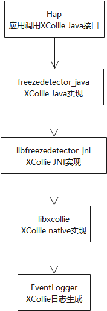

# HiCollie组件<a name="ZH-CN_TOPIC_0000001077200880"></a>

-   [简介](#section11660541593)
-   [系统架构](#section342962219551)
-   [目录](#section55125489224)
-   [约束](#section161941989596)
-   [编译构建](#section20568163942320)
-   [说明](#section12699104113233)
-   [接口说明](#section8725142134818)
-   [使用说明](#section19959125052315)
-   [相关仓](#section1134984213235)

## 简介<a name="section11660541593"></a>

HiCollie提供了软件看门狗功能。针对系统服务死锁、应用主线程阻塞，用户业务流程超时等故障，HiCollie提供了一套统一的用于故障检测和故障日志生成的框架，提供软件超时故障日志，辅助定位软件超时问题。

## 系统架构<a name="section342962219551"></a>



## 目录<a name="section55125489224"></a>

```
/base/hiviewdfx/hicollie                       #  HiCollie目录
├── frameworks/java                          # HiCollie java代码
├── frameworks/jni/                          # HiCollie jni代码
├── frameworks/native/                       # HiCollie native代码
├── interfaces/native/innerkits/include      # HiCollie native头文件
```

## 约束<a name="section161941989596"></a>

HiCollie接口单个进程最多可以注册128个定时器。超出上限的定时器注册操作无效，无法完成设定的逻辑超时检测功能。

## 编译构建<a name="section20568163942320"></a>

请参考HiCollie开发指南。

## 说明<a name="section12699104113233"></a>

## 接口说明<a name="section8725142134818"></a>

**表 1**  Java定时器接口功能描述表

<a name="table20156163414814"></a>
<table><tbody><tr id="row202881215133218"><td class="cellrowborder" valign="top" width="28.470000000000002%"><p id="p12852726173214"><a name="p12852726173214"></a><a name="p12852726173214"></a>int setTimeout(String timeoutName, int timeout, Runnable callback, long flag)</p>
</td>
<td class="cellrowborder" valign="top" width="18.01%"><p id="p185211260329"><a name="p185211260329"></a><a name="p185211260329"></a>XCollie类接口</p>
</td>
<td class="cellrowborder" valign="top" width="53.52%"><p id="p485219261329"><a name="p485219261329"></a><a name="p485219261329"></a>接口功能：添加定时器。</p>
<p id="p78521426113213"><a name="p78521426113213"></a><a name="p78521426113213"></a>输入参数：timeoutName：定时器名称。</p>
<p id="p193451754414"><a name="p193451754414"></a><a name="p193451754414"></a>输入参数：timeout：超时时间，单位为秒。</p>
<p id="p1954016498433"><a name="p1954016498433"></a><a name="p1954016498433"></a>输入参数：callback：超时回调函数。</p>
<p id="p18852172663215"><a name="p18852172663215"></a><a name="p18852172663215"></a>输入参数：flag：定时器操作类型，</p>
<p id="p685212264326"><a name="p685212264326"></a><a name="p685212264326"></a>XCOLLIE_FLAG_NOOP // 仅调用超时回调函数</p>
<p id="p158521269325"><a name="p158521269325"></a><a name="p158521269325"></a>XCOLLIE_FLAG_LOG //  生成超时故障日志</p>
<p id="p2852182633220"><a name="p2852182633220"></a><a name="p2852182633220"></a>XCOLLIE_FLAG_RECOVERY //  进程退出</p>
<p id="p17852152616325"><a name="p17852152616325"></a><a name="p17852152616325"></a>输出参数：无。</p>
<p id="p13852182643217"><a name="p13852182643217"></a><a name="p13852182643217"></a>返回值：成功返回定时器标识，失败返回-1。</p>
</td>
</tr>
<tr id="row921116343814"><td class="cellrowborder" valign="top" width="28.470000000000002%"><p id="p1421115341988"><a name="p1421115341988"></a><a name="p1421115341988"></a>boolean updateTimeout(int id, long timeout)</p>
</td>
<td class="cellrowborder" valign="top" width="18.01%"><p id="p1821117342082"><a name="p1821117342082"></a><a name="p1821117342082"></a>XCollie类接口</p>
</td>
<td class="cellrowborder" valign="top" width="53.52%"><p id="p8211534588"><a name="p8211534588"></a><a name="p8211534588"></a>接口功能：更新定时器。</p>
<p id="p1521114342084"><a name="p1521114342084"></a><a name="p1521114342084"></a>输入参数：id：定时器标识。</p>
<p id="p7560037101613"><a name="p7560037101613"></a><a name="p7560037101613"></a>输入参数：timeout：超时时间，单位为秒。</p>
<p id="p172111734384"><a name="p172111734384"></a><a name="p172111734384"></a>输出参数：无。</p>
<p id="p1621113347813"><a name="p1621113347813"></a><a name="p1621113347813"></a>返回值：成功返回true，失败返回false。</p>
</td>
</tr>
<tr id="row10211434984"><td class="cellrowborder" valign="top" width="28.470000000000002%"><p id="p1321133414818"><a name="p1321133414818"></a><a name="p1321133414818"></a>void cancelTimeout(int id)</p>
</td>
<td class="cellrowborder" valign="top" width="18.01%"><p id="p172111434384"><a name="p172111434384"></a><a name="p172111434384"></a>XCollie类接口</p>
</td>
<td class="cellrowborder" valign="top" width="53.52%"><p id="p32111534581"><a name="p32111534581"></a><a name="p32111534581"></a>接口功能：取消定时器。</p>
<p id="p121113341889"><a name="p121113341889"></a><a name="p121113341889"></a>输入参数：定时器标识。</p>
<p id="p821115348813"><a name="p821115348813"></a><a name="p821115348813"></a>输出参数：无。</p>
<p id="p1921113412810"><a name="p1921113412810"></a><a name="p1921113412810"></a>返回值：无。</p>
</td>
</tr>
</tbody>
</table>

## 使用说明<a name="section19959125052315"></a>

引入包名：

```
import ohos.hiviewdfx.xcollie.XCollie;
```

在业务代码中使用接口（添加/更新/取消定时器）：

```
int id = XCollie.getInstance().setTimeout("MyXCollieTimer", 10, new Runnable () {
                public void run() {
                    /* dump helpful information */
                }
         }, XCollie.XCOLLIE_FLAG_LOG);
/* time consuming job */
XCollie::getInstance().updateTimeout(id, 5);
/* time consuming job */
XCollie::getInstance().cancelTimeout(id);
......
```

## 相关仓<a name="section1134984213235"></a>

DFX子系统：

hmf/hiviwdfx

DFX组件：

hmf/hiviwdfx/hilog

hmf/hiviwdfx/hitrace

**hmf/hiviwdfx/hicollie**

hmf/hiviwdfx/hidumper

hmf/hiviwdfx/hiappevent

hmf/hiviwdfx/hisysevent

hmf/hiviwdfx/debug

